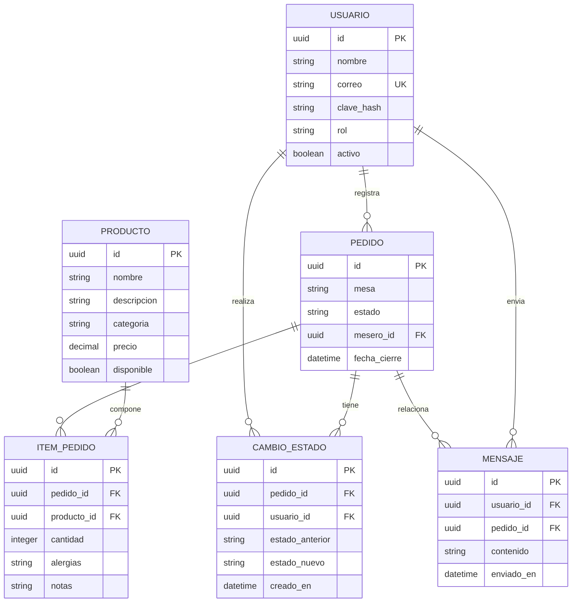

# Modelo entidad-relación de Orderix

```mermaid
erDiagram
    USUARIO ||--o{ PEDIDO : registra
    USUARIO ||--o{ CAMBIO_ESTADO : realiza
    PEDIDO ||--o{ ITEM_PEDIDO : contiene
    PRODUCTO ||--o{ ITEM_PEDIDO : compone
    PEDIDO ||--o{ CAMBIO_ESTADO : tiene
    PEDIDO ||--o{ MENSAJE : relaciona
    USUARIO ||--o{ MENSAJE : envia

    USUARIO {
        uuid id PK
        string nombre
        string correo UK
        string clave_hash
        string rol
        boolean activo
    }
    PEDIDO {
        uuid id PK
        string mesa
        string estado
        uuid mesero_id FK
        datetime fecha_cierre
    }
    PRODUCTO {
        uuid id PK
        string nombre
        string descripcion
        string categoria
        decimal precio
        boolean disponible
    }
    ITEM_PEDIDO {
        uuid id PK
        uuid pedido_id FK
        uuid producto_id FK
        integer cantidad
        string alergias
        string notas
    }
    CAMBIO_ESTADO {
        uuid id PK
        uuid pedido_id FK
        uuid usuario_id FK
        string estado_anterior
        string estado_nuevo
        datetime creado_en
    }
    MENSAJE {
        uuid id PK
        uuid usuario_id FK
        uuid pedido_id FK
        string contenido
        datetime enviado_en
    }
```
